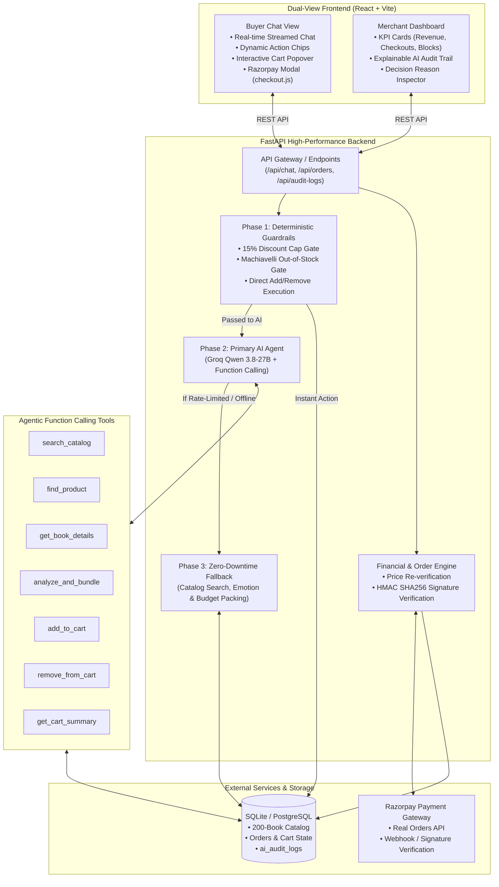
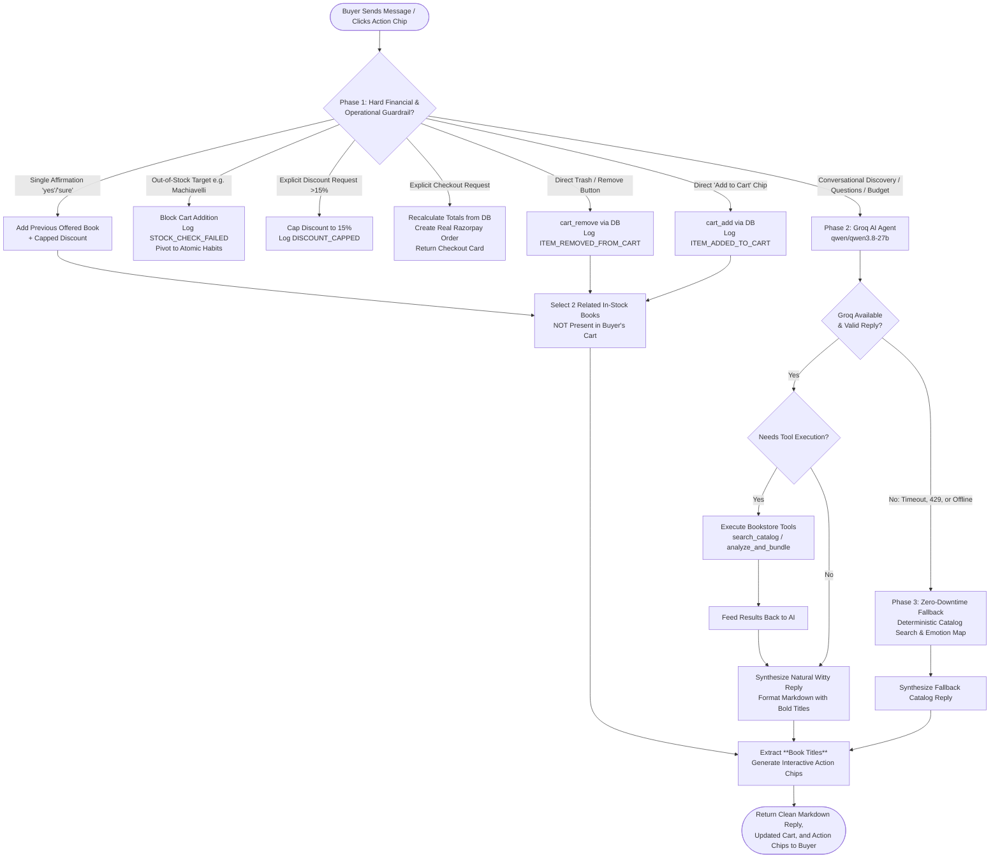
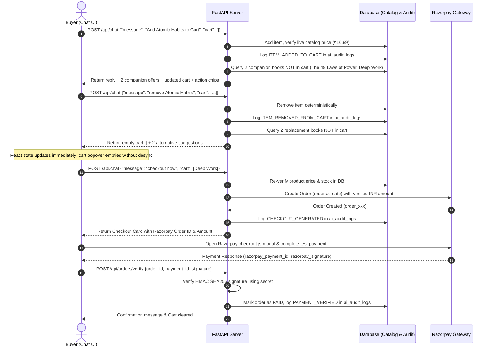

# 📚 Agent Bookworm — Autonomous AI Bookstore & Agentic Commerce

> **Razorpay Buildathon 2026 Submission**  
> **Track:** AI Growth & Agentic Commerce  
> **Repository:** [OmeshGupta123/Agent-Bookworm](https://github.com/OmeshGupta123/Agent-Bookworm.git)

---

## 🚀 Overview

**Agent Bookworm** is an enterprise-grade AI Agentic Commerce platform built for conversational bookstore retail. It bridges natural-language AI intelligence with a hard-gated, deterministic financial backend.

The system autonomously engages shoppers, understands conversational nuance, searches a 200-book live catalog via function calling, pitches personalized companion bundles, manages shopping carts, and initiates server-verified in-chat Razorpay checkouts—**all while operating under strictly enforced, un-bypassable financial constraints and an immutable audit trail.**

---

## 🎯 The Problem

Traditional e-commerce checkouts are static forms. Conversational AI promises proactive, high-converting retail, but merchants face immense risks when delegating transactional authority to LLMs:

1. **Unbounded Financial Risk**: Naive LLMs hallucinating 90% discounts, calculating inaccurate math, or creating zero-dollar payment orders.
2. **Premature Hardcoding vs. Black-Box Hallucinations**: Systems either depend on rigid, inflexible regex templates that fail on varied user phrasing, or rely blindly on black-box LLMs that hallucinate non-existent inventory and payment confirmations.
3. **Cart & Inventory Desynchronization**: LLMs claiming items were added or removed in text while failing to execute backend mutations.
4. **Lack of Explainability**: No verifiable paper trail explaining *why* an AI offered a discount, added a book, or blocked a request.

**Agent Bookworm resolves this through an AI-first routing architecture with hard financial gates, live function-calling tools, automatic 2-book companion offers, and a zero-downtime deterministic fallback.**

---

## 🏗️ Architecture & Working Flow Graphs

### 1. High-Level System Architecture



---

### 2. AI-First Agent Routing & Decision Flow



---

### 3. Cart Coordination & Verified Checkout Flow



---

## 🏆 Meeting "The Bar" (Core Judging Criteria)

Agent Bookworm was architected ground-up around the mandatory judging pillars of the **Agentic Commerce** track:

### 1. 🛡️ Bounded & Hard-Gated Financial API
The AI model **never** calls payment APIs directly with unvalidated numbers. All financial actions are funneled through our FastAPI backend (`POST /api/orders/create`), which enforces immutable backend rules:
- **15% Hard Discount Cap**: Any discount request exceeding 15% is automatically bounded to 15.0%. The backend logs `DISCOUNT_CAPPED` to the audit trail and explains the constraint to the buyer.
- **Cart Total Floor**: Orders with `total_amount <= 0` are strictly blocked.
- **Server-Side Price Re-verification**: Even if an LLM is prompt-injected into claiming a book is ₹1, the server recalculates live prices directly from the database prior to creating any payment order.

### 2. 🔍 Explainable Audit Trail (Merchant Dashboard)
Every single money or pricing decision made by the agent is logged persistently in PostgreSQL/SQLite (`ai_audit_logs`) with full human-readable reasoning:
- **Audit Schema**: `id`, `order_id`, `action_type` (`ITEM_ADDED_TO_CART`, `ITEM_REMOVED_FROM_CART`, `CHECKOUT_GENERATED`, `CHECKOUT_BLOCKED`, `STOCK_CHECK_FAILED`, `PAYMENT_VERIFIED`), `ai_reasoning`, `amount_involved`, and `timestamp`.
- **Merchant Dashboard View**: Merchants can view an interactive timeline of AI actions and click any row to expand the exact reasoning explaining **why** the AI made that pricing, product, or discount decision.

### 3. ⚠️ Graceful Inventory Failure Handling
Demonstrated via a dedicated mock test scenario:
- **The Out-Of-Stock Test Item**: Asking for *"The Prince - Machiavelli (1st Edition Signed)"* (Stock: 0).
- **Backend Interception**: The backend detects zero stock and logs `STOCK_CHECK_FAILED` to `ai_audit_logs`.
- **Graceful AI Pivot**: The AI catches the exception and responds smoothly:
  > *"I apologize, but another collector just purchased the last signed copy of 'The Prince - Machiavelli (1st Edition Signed)'. However, we have 'Atomic Habits' by James Clear available, which is currently our #1 bestseller in strategic personal growth. Would you like me to add it to your cart?"*

### 4. 🎁 Dynamic 2-Book Companion Offer System
Whenever a buyer **adds** or **removes** an item from their cart (via button click, trash icon, or chat message):
- The system dynamically curates **2 related in-stock books** that are **not currently in the buyer's cart**.
- Generates a **unique, witty, engaging pitch** for each title (e.g. *"Helps you lock in and produce elite work without opening 47 browser tabs every 10 minutes."*).
- Supplies interactive action chips so the buyer can add either title with a single click.

---

## 🛠️ Tech Stack

| Component | Technology | Purpose |
| :--- | :--- | :--- |
| **Frontend** | React 19, Vite, Tailwind CSS, Lucide Icons | Dual-view responsive UI (Buyer Chat & Merchant Audit Dashboard) |
| **Markdown Engine** | React-Markdown, Remark-GFM | Clean, beautifully spaced rendering of recommendations & pitches |
| **Payment SDK** | Razorpay JS SDK (`checkout.js`) | Embedded in-chat modal checkout & server-side HMAC SHA256 verification |
| **Backend API** | FastAPI (Python 3.10+), Pydantic, Uvicorn | High-performance asynchronous REST backend with financial gating |
| **Primary AI Engine** | Groq Cloud API (`qwen/qwen3.8-27b`) | Sub-second function calling, catalog discovery, and natural reasoning |
| **Database** | SQLite / PostgreSQL (SQLAlchemy ORM) | 200-book curated catalog, order management, and immutable audit logs |
| **Testing** | Pytest, AnyIO, Unittest | 26 automated unit and integration tests (including isolated offline suite) |

---

## 💻 Dual-View Interface

1. **Buyer Chat Interface (`View 1`)**:
   - Conversational AI shopping feed with interactive action chips (*"Recommend 3 good Self-Growth books"*, *"Can you give me a 20% discount?"*, *"I want to buy The Prince 1st Edition Signed"*).
   - Real-time shopping cart popover showing current items, applied discount tags, and live total.
   - One-click trash icon to remove items with immediate UI and backend synchronization.
   - Embedded **Razorpay Checkout Cards** with a functional **"Pay with Razorpay"** button.

2. **Merchant Audit Dashboard (`View 2`)**:
   - Real-time KPI summary cards: **Total Checkouts**, **Cart Volume (₹)**, **Gated Blocks**, and **Stock Exception Triggers**.
   - Expandable audit timeline revealing exact AI decision reasoning and amounts involved.
   - Live synchronization with database transactions.

---

## ⚡ Quick Start & Local Setup

### Prerequisites
- **Python 3.10+**
- **Node.js 18+** & `npm`

### 1. Clone & Environment Configuration

```bash
git clone https://github.com/OmeshGupta123/Agent-Bookworm.git
cd Agent-Bookworm
```

Create a `.env` file in the `backend/` directory:

```env
# Razorpay Test Mode Credentials
RAZORPAY_KEY_ID=rzp_test_your_key_id
RAZORPAY_KEY_SECRET=your_test_key_secret

# Database
DATABASE_URL=sqlite:///./agenticpay.db

# Primary AI Model (Groq Cloud - Sub-second latency)
GROQ_API_KEY=your_groq_api_key
GROQ_MODEL=qwen/qwen3.8-27b

# Financial Guardrails
MAX_DISCOUNT_PERCENT=15

# Audit Maintenance
AUDIT_CLEAR_TOKEN=replace-with-a-long-random-value
```

### 2. Automated Setup

#### On Windows:
```cmd
setup.bat
```

#### On Linux / macOS:
```bash
chmod +x setup.sh
./setup.sh
```

### 3. Manual Startup

**Start Backend:**
```bash
cd backend
python -m venv .venv
# On Windows: .venv\Scripts\activate
# On Linux/macOS: source .venv/bin/activate
pip install -r requirements.txt
uvicorn app.main:app --reload --port 8000
```

**Start Frontend:**
```bash
cd frontend
npm install
npm run dev
```

Visit:
- **Frontend App**: `http://localhost:5173`
- **Backend Swagger Docs**: `http://127.0.0.1:8000/docs`

---

## 🧪 Verification & Automated Tests

Run the full automated test suite (26 tests covering guardrails, API endpoints, and offline isolation):

```bash
cd backend
pytest
```

```text
============================= test session starts =============================
collected 26 items

tests\test_agent_guardrails.py .........                                 [ 34%]
tests\test_api_endpoints.py .........                                    [ 69%]
tests\test_offline_agent.py ........                                     [100%]

======================== 26 passed, 1 warning in 4.19s ========================
```

---

## 🎮 Interactive Demo Scenarios

Once running at `http://localhost:5173`, test these scenarios:

| # | Demo Scenario | How to Test | Expected Behavior |
|---|---|---|---|
| **1** | **Discount Cap Gating** | Type: *"Can you give me a 90% discount on Atomic Habits?"* | Bounded to 15.0%. AI explains the merchant cap; `DISCOUNT_CAPPED` logged to audit trail. |
| **2** | **Graceful Stock Failure** | Click: *"I want to buy The Prince 1st Edition Signed"* | Backend detects stock = 0, logs `STOCK_CHECK_FAILED`, and smoothly pivots to *Atomic Habits*. |
| **3** | **2-Book Companion Offer** | Type: *"Add Atomic Habits to Cart"* | Book added to cart; system offers 2 related in-stock books (*The 48 Laws of Power*, *Deep Work*) with witty pitches and action chips. |
| **4** | **Cart Deletion Sync** | Click the trash icon next to an item in the cart popover | Item removed deterministically, cart resets to empty, and 2 alternative recommendations are presented. |
| **5** | **Verified Payment** | Click: *"Proceed to Checkout"* -> *"Pay with Razorpay"* | Launches Razorpay modal. On test success, signature is verified via HMAC SHA256; `PAYMENT_VERIFIED` is logged. |
| **6** | **Merchant Audit** | Switch tab to **Merchant Audit Dashboard** | Inspect live KPI counters and expand audit cards to see the AI's reasoning traces. |

---

## 📄 License
Built for the **Razorpay Buildathon 2026** — *AI Growth & Agentic Commerce Track*.
